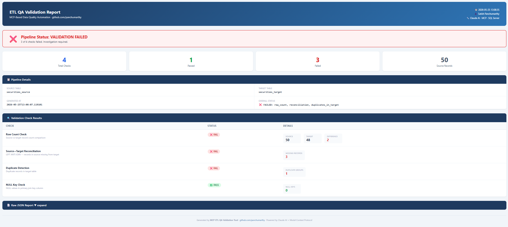

# MCP-Based ETL QA Validation Tool

> AI-powered ETL data quality validation agent — plain English in, professional QA report out.

**Author:** Satish Panchumarthy · [github.com/panchumarthy](https://github.com/panchumarthy)  
**Stack:** Python · Claude AI (Anthropic) · MCP · Microsoft SQL Server · pyodbc

---

## What This Is

An agentic QA validation tool built on Anthropic's **Model Context Protocol (MCP)**.  
You describe what you want to validate in plain English. Claude autonomously calls the right SQL Server validation tools, analyzes the results, and generates a professional HTML report — no SQL writing required.

```
You:  "Validate today's securities pipeline run"
          ↓
    Claude Agent (Anthropic API)
          ↓  MCP protocol (stdio)
    QA MCP Server (Python)
          ↓  pyodbc
    SQL Server — ETL_QA_Demo
          ↓
    HTML Report (auto-opens in browser)
```

---

## Architecture

```
┌─────────────────────────────────────────────────────────────────┐
│                        qa_agent.py                              │
│              Claude AI  ·  Anthropic API                        │
│   Receives tool list → decides what to call → synthesizes report│
└────────────────────────┬────────────────────────────────────────┘
                         │  MCP stdio protocol
┌────────────────────────▼────────────────────────────────────────┐
│                     qa_mcp_server.py                            │
│                   Python MCP Server                             │
│  list_tables · row_count_check · null_check · duplicate_check   │
│  source_target_reconciliation · referential_integrity_check     │
│  get_table_schema · data_type_validation · generate_qa_report   │
└────────────────────────┬────────────────────────────────────────┘
                         │  pyodbc
┌────────────────────────▼────────────────────────────────────────┐
│               Microsoft SQL Server (local)                      │
│    ETL_QA_Demo database                                         │
│    securities_source  ·  securities_target                      │
│    orders_source      ·  orders_target  ·  customers            │
└────────────────────────┬────────────────────────────────────────┘
                         │
┌────────────────────────▼────────────────────────────────────────┐
│                   report_generator.py                           │
│    Styled HTML report → reports/qa_report_YYYYMMDD_HHMMSS.html  │
│    Auto-opens in browser after every run                        │
└─────────────────────────────────────────────────────────────────┘
```

---

## QA Tools Available

| Tool | What It Does | SQL Pattern |
|---|---|---|
| `list_tables` | Discover all tables in the database | `INFORMATION_SCHEMA.TABLES` |
| `get_table_schema` | Column names, types, nullability | `INFORMATION_SCHEMA.COLUMNS` |
| `row_count_check` | Compare source vs target counts | `SELECT COUNT(*)` on both |
| `null_check` | Find NULLs across columns | `COUNT(*) WHERE col IS NULL` |
| `duplicate_check` | Find duplicate records by key | `GROUP BY key HAVING COUNT > 1` |
| `source_target_reconciliation` | Records in source missing from target | LEFT ANTI JOIN |
| `data_type_validation` | Validate numeric / date / length formats | `TRY_CAST`, `LEN` checks |
| `referential_integrity_check` | Orphaned foreign key records | LEFT JOIN parent WHERE NULL |
| `generate_qa_report` | Full pipeline validation in one call | All checks combined |

---

## Screenshots

### Terminal — Agent Running

```
╔══════════════════════════════════════════════════════════╗
║        MCP-Based ETL QA Validation Agent                 ║
║        Powered by Claude + SQL Server                    ║
╚══════════════════════════════════════════════════════════╝
✅ MCP QA Server connected

> Run a full QA report on the securities pipeline

🤖 Agent thinking...
────────────────────────────────────────────────────────────
🔧 Calling tool: list_tables
🔧 Calling tool: get_table_schema
   Args: { "table_name": "securities_source" }
🔧 Calling tool: generate_qa_report
   Args: { "source_table": "securities_source", "target_table": "securities_target" }
   Result: ❌ FAILED: row_count, reconciliation, duplicates_in_target

Overall Status: ❌ PIPELINE FAILED — 3 of 4 checks failed

| Check             | Status  | Detail                                   |
|-------------------|---------|------------------------------------------|
| Row Count         | ❌ FAIL | Source: 50 · Target: 48 · Difference: 2 |
| Reconciliation    | ❌ FAIL | 3 records missing from target            |
| Duplicate Check   | ❌ FAIL | 1 duplicate group (trade_id 1001)        |
| NULL Key Check    | ✅ PASS | No NULL trade_ids                        |

📊 HTML Report saved → reports/qa_report_20260525_125308.html
```

### HTML Report Output


---

## Setup

### Prerequisites

- Python 3.10+
- Microsoft SQL Server (local instance)
- SQL Server Management Studio (SSMS)
- [ODBC Driver 17 for SQL Server](https://learn.microsoft.com/en-us/sql/connect/odbc/download-odbc-driver-for-sql-server)
- Anthropic API key → [console.anthropic.com](https://console.anthropic.com)

### Step 1 — Clone the repo

```bash
git clone https://github.com/panchumarthy/MCP-based-ETL-QA-tool.git
cd MCP-based-ETL-QA-tool
```

### Step 2 — Create virtual environment

```bash
python -m venv venv

# Windows Git Bash
source venv/Scripts/activate

# Mac / Linux
source venv/bin/activate
```

### Step 3 — Install dependencies

```bash
pip install -r requirements.txt
```

### Step 4 — Set up the demo database

Open **SSMS**, connect to your local SQL Server, open `scripts/setup_sqlserver.sql` and execute it.

This creates the `ETL_QA_Demo` database with realistic securities and orders pipeline data — including **intentional defects** so the tool has real problems to catch:

| Defect | Detail |
|---|---|
| 3 dropped records | Trade IDs 1005, 1010, 1015 missing from target ($388,690 in trade value) |
| 1 duplicate load | Trade ID 1001 inserted twice into target |
| 1 NULL column | `broker_code` NULL on trade 1003 |
| 1 wrong amount | `trade_amount` incorrect on trade 1007 |
| 2 dropped orders | Order IDs 5006, 5009 missing from orders_target |
| 1 orphaned FK | Account ACC999 in orders_source has no match in customers table |

### Step 5 — Set your Anthropic API key

```bash
# Git Bash / Mac / Linux
export ANTHROPIC_API_KEY=your-api-key-here

# Windows CMD
set ANTHROPIC_API_KEY=your-api-key-here
```

### Step 6 — Update connection string (if needed)

Edit `src/qa_agent.py` and find `DEFAULT_CONNECTION`:

```python
DEFAULT_CONNECTION = (
    "DRIVER={ODBC Driver 17 for SQL Server};"
    "SERVER=localhost;"          # ← change to your server name if needed
    "DATABASE=ETL_QA_Demo;"      #   e.g.  .\SQLEXPRESS  or  LAPTOP-NAME\SQLEXPRESS
    "Trusted_Connection=yes"     # ← Windows Auth; or use UID=sa;PWD=... for SQL Auth
)
```

To find your server name, check the login screen in SSMS.

### Step 7 — Run

```bash
python src/qa_agent.py
```

---

## Demo Queries

Run these in order for a complete demo:

```
> List all available tables
> Run a full QA report on the securities pipeline
> Check for NULL values in securities_target
> Find duplicate trades in securities_target
> Check referential integrity between orders_source and customers
> Run a full QA report on the orders pipeline
```

**Single query mode (non-interactive):**

```bash
python src/qa_agent.py --query "Run a full QA report on the securities pipeline"
```

---

## HTML Report

Every run automatically saves a timestamped HTML report to `reports/` and opens it in your browser.

Each report includes:
- Overall pipeline status banner (green = PASS, red = FAIL)
- Summary cards: total checks, passed, failed, source record count
- Per-check results table with PASS / FAIL badges and detail metrics
- Raw JSON section (collapsible) for automation and integration

Report naming: `reports/qa_report_YYYYMMDD_HHMMSS.html`

---

## Project Structure

```
MCP-based-ETL-QA-tool/
├── src/
│   ├── qa_mcp_server.py      # MCP server — 9 SQL validation tools exposed to Claude
│   ├── qa_agent.py           # Claude agent — orchestrates tool calls, saves report
│   └── report_generator.py  # Styled HTML report generator
├── scripts/
│   └── setup_sqlserver.sql  # Demo database setup with intentional defects seeded
├── reports/                  # Auto-created — timestamped HTML reports saved here
├── docs/                     # Screenshots and documentation assets
├── requirements.txt
└── README.md
```

---

## How the Agentic Loop Works

```
1. You type a plain English query
         ↓
2. qa_agent.py fetches tool list from MCP server
         ↓
3. Tool list + query sent to Claude via Anthropic API
         ↓
4. Claude decides which tools to call and with what arguments
         ↓
5. qa_mcp_server.py executes SQL against SQL Server via pyodbc
         ↓
6. Results return to Claude as tool_result messages
         ↓
7. Claude reasons about results → calls more tools or writes final report
         ↓
8. report_generator.py creates HTML report → auto-opens in browser
```

---

## Skills Demonstrated

| Skill | Evidence |
|---|---|
| MCP (Model Context Protocol) | Full MCP server with 9 tools built from scratch |
| Agentic AI | Claude autonomously orchestrates multi-step validation |
| ETL Data Quality | Production patterns: count checks, anti-joins, null checks, referential integrity |
| Python | Async MCP server, pyodbc, Anthropic SDK, HTML generation |
| SQL Server | Schema design, complex queries, INFORMATION_SCHEMA, TRY_CAST |
| Data Engineering | Source-to-target validation methodology from 13 years in financial services |

---

## Troubleshooting

| Error | Fix |
|---|---|
| `src refspec main does not match` | Run `git branch -m master main` then push again |
| `Repository not found` | Create the repo on github.com/new first (empty, no README) |
| `set` not working in Git Bash | Use `export` instead of `set` |
| `%ANTHROPIC_API_KEY%` prints literally | You are in Git Bash — use `echo $ANTHROPIC_API_KEY` |
| SQL Server connection fails | Check `SERVER=` value — try `.\SQLEXPRESS` or `LAPTOP-NAME\SQLEXPRESS` |
| `unhashable type: dict` error | Replace `qa_agent.py` and `report_generator.py` with latest versions |

---

## Interview Talking Point

> *"I built an MCP-based QA agent where Claude autonomously orchestrates multiple database validation checks — row counts, LEFT ANTI JOINs for dropped records, duplicate detection, and referential integrity — all triggered by a plain English query. The MCP server exposes each check as a discrete tool, and Claude decides which tools to call and in what order. This is the same reconciliation logic I applied manually at Wells Fargo Securities for 13 years, now driven by an AI agent."*

---

## License

MIT — free to use, modify, and share.

---

*Built with Claude AI · Anthropic MCP · Microsoft SQL Server*
